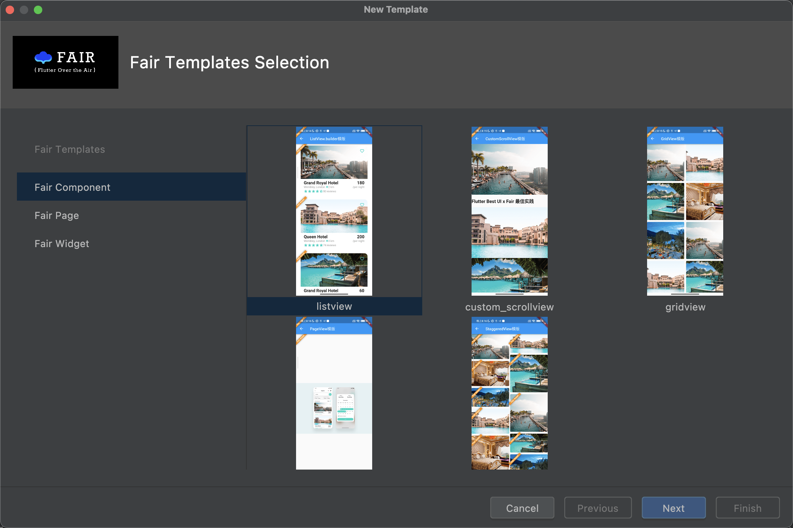
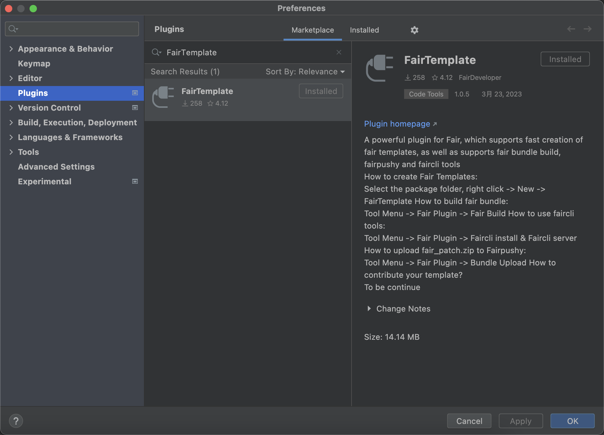
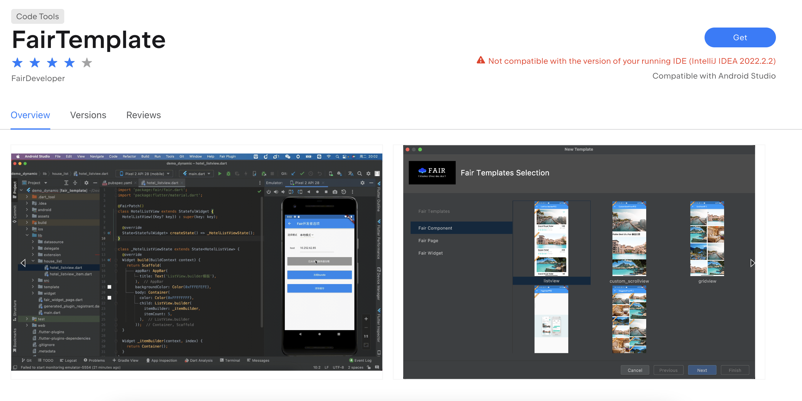
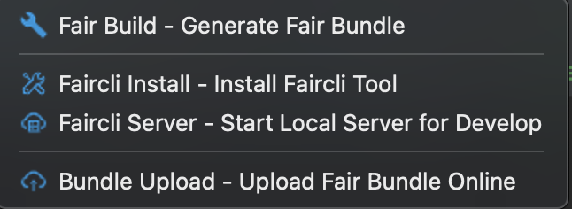

## 前置知识
[wuba/FairTemplate](https://github.com/wuba/FairTemplate)仓库采用git-submodules的方式与[wuba/fair](https://github.com/wuba/Fair)仓库建立的关联，如需要详细了解git-submodule，[请点解这里](https://git-scm.com/docs/git-submodule)

## 🔧模版共建

模版共建流程:
- 使用fair进行编写颗粒度为Widget/Component/Page的模版
- 将**wuba/FairTemplate**仓库拉取下来，如果分支不是main请切换至main
- 将编写好的模版按指定格式进行提交并创建pr
- 审核通过后会对**wuba/FairTemplate**仓库进行打tag并发布
- FairTemplate Idea插件在一定的时间间隔内对模版进行更新，更新完成后就可以看到您提交的模版了

### FairTemplate Idea插件

[FairTemplate](https://plugins.jetbrains.com/plugin/20323-fairtemplate) idea 插件运行效果如下图所示:
<html>

</html>

#### 一、FairTemplate Idea插件安装

如果您是在Android Studio上进行fair开发

1.可以在preferences-plugins-Marketplace搜索FairTemplate并安装
<html>

</html>

2.可以去[jetbrains marketplace](https://plugins.jetbrains.com/plugin/20323-fairtemplate)进行安装
<html>

</html>

**如果您是在IntelliJ IDEA或者VS Code上进行开发，此插件暂时还没适配，敬请期待～**

#### 二、FairTemplate Idea插件使用

- 快速创建模版
<html>

</html>

- 其他功能
    - Fair Build: 一键编译打包生成fair产物
    - Faircli Install: 安装faircli工具
    - Faircli Server: 启动faircli工具
    - Bundle Upload: 上传fair编译产物到热更新平台
<html>

</html>

#### 三、FairTemplate Idea插件常见问题
- 创建完模版但项目中没有展示？
> 刷新一下项目即可 -> Reload from disk

- 打开插件一直在loading？
> 如果长时间loading建议先访问github.com，看是否能够打开，如不能请科学上网。如果能正常访问GitHub，请检查一下event log有没有报错信息，如果有报错信息可以提issue并附上相关异常信息

- 模版检测更新的间隔时长是多久？
> 目前定的是每隔12小时更新一次

### 模版共建提交格式要求

提交模版需要包含两个部分，一部分是代码模版本身，另一部分是模版封面图

- 模版代码
> 代码模版按照颗粒度分为3种类型，分别是widget、component和page，都管理在templates目录下
> 
> 其中widget和page对应提交的格式都是 ${template_dir_name}/${template_code_file_name}.dart，示例: circle_avatar/circle_avatar.dart
> 
> component相对特殊，的目录结构对应的是 ${template_dir_name}/standard/${template_code_file_name}.dart 和 ${template_dir_name}/extra/${extra_file_name}，如果只包含dart文件只需要提交standard即可，如果包含非dart文件，则需要放在extra一并提交。示例如: circle_avatar/standard/circle_avatar.dart(如果包含非dart文件:circle_avatar/extra/circle_avatar.js)

- 模版封面
> 封面图目前支持png、webp和gif，兼容性最好的是png，建议提交时采用png格式
> 
> 封面图统一放置在images目录下
> 
> 封面图与模版关联方式->图片名称匹配模版目录名称，为避免高度重合，建议起名时慎重且细致化一点
> 
> 封面图与模版关联方式后续可能会进行修改

## 🔗Fair相关链接

### Fair

> 在线文档：[https://fair.58.com/](https://fair.58.com/)

### Fair Pushy

> 热更新平台：[FAIR PUSHY](https://github.com/wuba/FairPushy)

### fair-online云开发平台

> 在线体验地址： [Fair-Online Platform](https://fair-online.58.com/)
>
> 更多介绍请查看: [文档](https://github.com/wuba/Fair/blob/main/fair_online/README.md)

### fair提效工具 - faircli

>  [pub地址](https://pub.dev/packages/faircli)